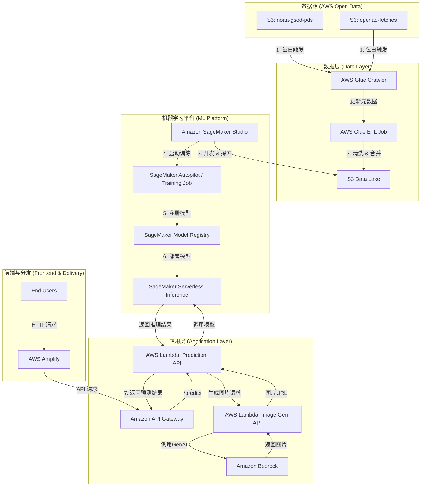

# 设计文档: 全球城市空气质量预测平台

## 1. 需求分析

根据与ABC公司的初步会议，我们确定了以下核心业务和技术需求：

- **业务目标**: 推出一款全球城市空气质量预测产品，服务于企业和个人用户。
- **核心功能**:
  - 预测未来1天（24小时）的AQI。
  - 为个人用户生成包含城市特色、AQI信息和健康建议的图片。
- **数据源**:
  - NOAA全球每日地面汇总数据 (天气)
  - OpenAQ (空气质量)
- **技术挑战与未来规划**:
  1.  **数据扩展性**: 系统需要能够处理不断增长的全球数据。
  2.  **云端IDE**: 数据科学家需要一个集成的、基于Web的开发环境。
  3.  **AutoML**: 希望利用AutoML能力来高效评估和迭代模型。
  4.  **GenAI**: 使用生成式AI为个人用户创建每日分享图。
- **团队限制**: 当前团队规模较小，希望专注于业务逻辑而非基础设施维护。

## 2. 推荐架构：基于AWS的无服务器解决方案

为了满足ABC公司的需求，我们推荐一套基于AWS的现代化、高可用且具备成本效益的无服务器（Serverless）架构。该架构旨在最大限度地减少基础设施管理开销，同时提供强大的可扩展性和灵活性。

### 2.1. 架构图

### 2.2. 架构组件详解

#### **数据层 (Data Layer)**

- **AWS Glue (C, D)**: 我们使用AWS Glue来构建自动化的ETL（提取、转换、加载）管道。
  - **Glue Crawler**: 每天自动扫描NOAA和OpenAQ的S3存储桶，发现新的数据分区并更新Glue数据目录。
  - **Glue ETL Job**: 当有新数据时自动触发。该作业会读取原始数据，执行与`ml/prepare_data.py`中类似的清洗、合并和转换逻辑，并将处理好的、可用于训练的数据存放在我们自己的S3 Data Lake中。
- **Amazon S3 Data Lake (E)**: 作为我们集中式、可扩展且经济高效的数据存储。所有原始数据、处理后的数据和模型产物都存储在这里。这解决了**数据扩展性**的挑战。

#### **机器学习平台 (ML Platform)**

- **Amazon SageMaker Studio (F)**: 这是为数据科学家团队提供的**一站式Web IDE**。他们可以在Studio中进行数据探索（EDA）、编写代码、构建模型、调试和监控，而无需管理任何服务器。
- **Amazon SageMaker Training (G)**: 提供了多种训练模型的选项。
  - **SageMaker Autopilot**: 完美匹配客户的**AutoML需求**。数据科学家只需提供数据集和目标列，Autopilot就能自动探索不同的解决方案并找到最佳模型。
  - **自定义训练任务**: 对于像`AutoGluon`这样的高级库，可以将其打包在自定义容器中，并作为SageMaker训练任务运行，利用AWS强大的计算资源进行分布式训练。
- **SageMaker Model Registry (H)**: 训练好的模型被版本化并注册在这里，方便追踪、审计和部署。
- **SageMaker Serverless Inference (I)**: 将最终模型部署为无服务器推理端点。它会根据流量自动扩缩容（甚至可以缩容到零），这意味着**只有在处理请求时才需要付费**，极大地降低了空闲成本，非常适合初创产品。

#### **应用层 (Application Layer)**

- **API Gateway (J) & AWS Lambda (K, L)**: 我们使用API Gateway和Lambda函数构建后端的微服务。
  - **Prediction API (K)**: 接收前端请求，调用SageMaker端点进行推理，然后调用图片生成API。
  - **Image Gen API (L)**: 接收预测结果（如城市、天气、AQI等级），然后调用Amazon Bedrock。
  - 这种无服务器架构无需管理服务器，并且可以轻松应对流量高峰。
- **Amazon Bedrock (M)**: 这项服务直接满足了**GenAI图片生成**的需求。我们可以通过API轻松访问包括Stable Diffusion、Titan Image Generator在内的多种业界领先的基础模型，根据AQI预测结果动态生成高质量、符合情景的图片。

#### **前端与分发 (Frontend & Delivery)**

- **AWS Amplify (N)**: 用于托管我们的Web前端。Amplify简化了构建、部署和托管全栈应用的流程，集成了CI/CD管道，可以实现代码提交后自动部署，让研发团队能快速迭代。

## 3. 结论

该架构为ABC公司提供了一个强大、可扩展且经济高效的起点。它直接解决了客户提出的所有核心挑战：

- **专注于业务**: 整个架构大量使用AWS托管和无服务器服务，将运维负担降至最低。
- **可扩展**: 从数据湖到无服务器API和推理端点，架构的每个部分都可以独立扩展。
- **满足未来需求**: 内置了业界领先的云端IDE (SageMaker Studio)、AutoML (SageMaker Autopilot) 和 GenAI (Amazon Bedrock) 功能，为产品未来的创新和发展奠定了坚实的基础。

通过采用此架构，ABC公司可以快速启动其产品，并在业务增长时充满信心地进行扩展。 